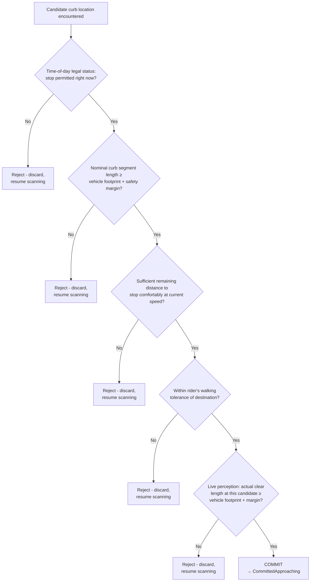

```mermaid
flowchart TD
    A[Candidate curb location encountered] --> B{Time-of-day legal status:\nstop permitted right now?}
    B -- No --> R1[Reject - discard,\nresume scanning]
    B -- Yes --> C{Nominal curb segment length ≥\nvehicle footprint + safety margin?}
    C -- No --> R2[Reject - discard,\nresume scanning]
    C -- Yes --> D{Sufficient remaining distance to\nstop comfortably at current speed?}
    D -- No --> R3[Reject - discard,\nresume scanning]
    D -- Yes --> E{Within rider's walking\ntolerance of destination?}
    E -- No --> R4[Reject - discard,\nresume scanning]
    E -- Yes --> G{Live perception: actual clear\nlength at this candidate ≥\nvehicle footprint + margin?}
    G -- No --> R5[Reject - discard,\nresume scanning]
    G -- Yes --> F[COMMIT\n→ CommittedApproaching]
```