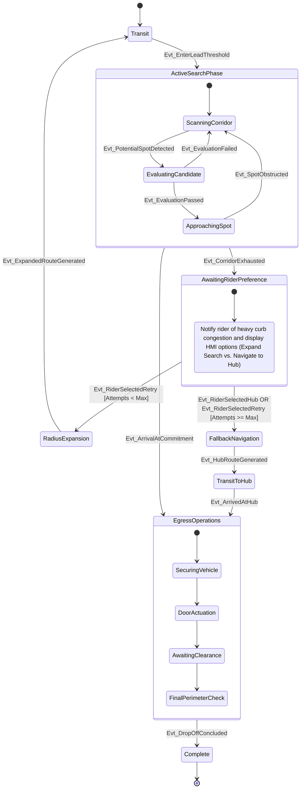

## State chart
 

### State Dictionary
* **Transit**
The vehicle executes baseline route navigation and lane-keeping. Opportunistic curb scanning and evaluations are inactive.

* **ActiveSearchPhase**
A composite state governing the tactical search loop. The vehicle actively fuses prior map restriction data with live perception to evaluate curb viability along the current route segment.

    * **ScanningCorridor**
    The baseline search activity scanning the right-of-way for valid constraints.

    * **EvaluatingCandidate**
    A dedicated assessment phase verifying a specific curb segment against time-of-day legality, physical clearance, and walking tolerance.

    * **ApproachingSpot**: The kinematic execution phase maneuvering the vehicle to pull into the verified, committed drop-off constraint.

* **AwaitingRiderPreference**
A human-in-the-loop decision state where tactical search is paused because the initial corridor is exhausted. The system queries the rider via the HMI to supply preference based on their personal schedule tolerance.

* **RadiusExpansion**
An intermediary logic state active when the rider opts to retry, prompting the system to request a new route sweeping adjacent, previously unscanned street segments.

* **FallbackNavigation**
The system prepares to abandon opportunistic searching entirely and calculates a direct route to a pre-designated, high-capacity drop-off hub based either on rider selection or exhausted retry limits.

* **TransitToHub**
The vehicle executes point-to-point navigation toward the fallback hub with opportunistic curb scanning suspended.

* **EgressOperations**
A composite state managing the physical drop-off, incorporating vehicle hold, door unlock commands, rider notifications, and safety interlocks.

* **Complete**
Terminal state indicating the passenger drop-off sequence has safely concluded and the vehicle is ready for its next operational directive.

### Event & Signal Dictionary

* Evt_EnterLeadThreshold: The ego vehicle crosses the predefined approach distance to the drop-off coordinate.

* Evt_PotentialSpotDetected: A geometrically viable curb space enters the short-range perception window.

* Evt_EvaluationFailed: The targeted curb space fails one or more verification checks (e.g., active time-of-day restriction or physical obstruction).

* Evt_EvaluationPassed: The targeted curb space successfully passes all legal, physical, and proximity checks.

* Evt_SpotObstructed: A dynamic obstacle invalidates a previously committed target spot.

* Evt_CorridorExhausted: The ego vehicle reaches the trail threshold past the destination without securing a valid spot, triggering the HMI preference prompt.

* Evt_RiderSelectedRetry: Rider input via HMI confirms willingness to spend time on an expanded search pass (Attempts < Max).

* Evt_RiderSelectedHub: Rider input via HMI elects to bypass further local searching and head directly to a fallback hub.

* Evt_ExpandedRouteGenerated: The upstream routing module successfully publishes a new sweep trajectory following rider confirmation.

* Evt_HubRouteGenerated: The upstream routing module successfully publishes a direct trajectory to the fallback hub.

* Evt_ArrivedAtHub: Ego velocity reaches 0 m/s at the designated fallback hub coordinate.

* Evt_ArrivalAtCommitment: Ego velocity reaches 0 m/s at the opportunistically targeted stop constraint.

* Evt_DropOffConcluded: The rider is clear of the door-clearance sensor envelope, doors are secured, and the system clears the vehicle for departure.