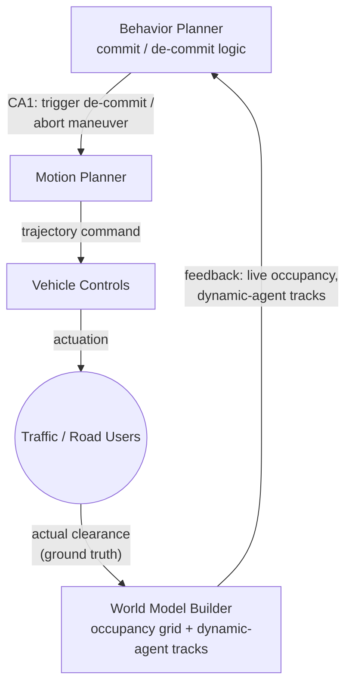

# STPA: De-Commit Abort Maneuver

Control action: Behavior Planner → Motion Planner, "trigger de-commit / abort maneuver" (exhaustive_failures_list.md, Item 24)

------------------------------
## Losses and Hazards

* L1 - Injury or fatality to a road user from a collision.
* H1 - The vehicle enters a lane or path without verifying it is clear of another road user.
* SC1 - The vehicle must not execute a lane-reentry or abort trajectory without verifying the target path is clear of moving road users, for the full duration of the maneuver.

------------------------------
## Control Structure

------------------------------
## Unsafe Control Actions

* **UCA1-1 (Providing causes hazard):** Behavior Planner triggers the abort maneuver and releases the stop-fence constraint without checking that the target lane is clear of a trailing cyclist or adjacent traffic. → H1, SC1. This is Item 24 - currently unmitigated; no `abort_path_clearance` check exists in the specified de-commit function today.
* **UCA1-2 (Not providing causes hazard):** Behavior Planner fails to trigger de-commit when a genuine obstruction has appeared at the committed spot, continuing the approach toward it. → H1, via collision with the obstruction. This is Item 23 - the re-check cadence is too slow to catch a persistent obstruction.
* **UCA1-3 (Wrong timing):** Behavior Planner triggers the abort maneuver correctly with respect to clearance at the instant it checks, but the check is a single instantaneous read rather than held for the full duration of the merge - a road user entering the target lane mid-maneuver is never caught. → H1, SC1.
* **UCA1-4 (Wrong duration):** Not distinct here - de-commit is a discrete trigger, not a sustained control action, so this collapses into UCA1-3.

------------------------------
## Loss Scenarios

* **Missing process-model input:** Behavior Planner's de-commit logic does not query World Model Builder's dynamic-agent track list at all - its process model of "safe to release" is built only from curb-side clearance (the same fields node C/G use), not lane-side occupancy. The feedback exists in the architecture (WMB already fuses it); the control logic simply never asks for it.
* **No downstream arrestor:** Motion Planner executes whatever trajectory Behavior Planner commands, and Vehicle Controls actuates whatever Motion Planner sends. There is no independent check between the abort decision and physical execution.

**Traceability:** exhaustive_failures_list.md Item 24. Design decision needed: an `abort_path_clearance` check held for the full duration of the merge, not just at trigger time.