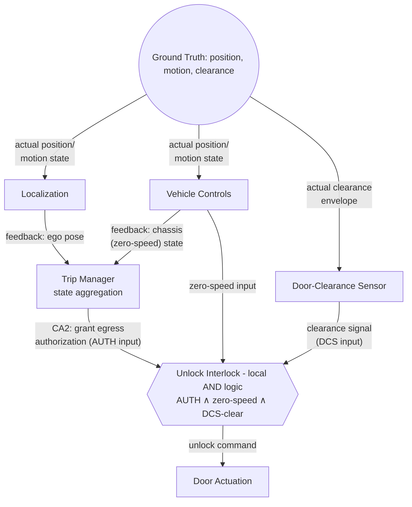

# STPA: Egress Authorization on Stale Ground Truth

Control action: Trip Manager → Vehicle Controls, "grant egress authorization" (exhaustive_failures_list.md, Item 31)

------------------------------
## Losses and Hazards

* L2 - Injury to the rider during egress.
* H2 - The vehicle enables rider egress (unlocks/opens a door) without verifying the vehicle is at rest in a location and orientation already confirmed safe.
* SC2 - The vehicle must not authorize rider egress unless the vehicle's actual, current position and motion state match a location and condition already verified safe by the commit decision.

------------------------------
## Control Structure

CA2 is one of three inputs into Vehicle Controls' unlock interlock (Item 38), not the last word on egress. This matters for reading UCA2-1 below: the interlock is real mitigation for some unsafe-CA2 scenarios, but not for that one - in that scenario the vehicle is genuinely stopped and the door path is genuinely clear, so zero-speed and DCS-clear both read true, the AND-gate passes, and the bad authorization rides through untouched. That's why Item 31 (the CA2-level gap) and Item 38 (the interlock's own logic) are tracked as two separate findings rather than one covering the other.

------------------------------
## Unsafe Control Actions

* **UCA2-1 (Providing causes hazard):** Trip Manager grants egress authorization using Localization and Vehicle Controls feedback without checking either for age, so authorization can be issued against a stale position or chassis-state read. → H2, SC2. This is Item 31 - no staleness check exists on either input today.
* **UCA2-2 (Not providing causes hazard):** Trip Manager withholds authorization while the vehicle is genuinely stopped at the verified location. → fail-safe; mission-delay only, not loss-relevant.
* **UCA2-3 (Wrong timing):** Trip Manager grants authorization before Vehicle Controls' zero-speed confirmation and the Door-Clearance Sensor's clearance signal are themselves current - a race condition where authorization is computed against one cycle's data and consumed against another's. → H2, SC2.
* **UCA2-4 (Wrong duration):** Authorization, once granted, remains latched as "granted" if the vehicle subsequently moves again (a repositioning micro-adjustment) without being explicitly revoked. → H2, SC2.
  **Constraint:** the authorization flag must explicitly clear and require re-evaluation the instant ego-motion exceeds a defined micro-adjustment threshold (Δx, Δv) - not on the next nominal cycle - so a stale "granted" state can never be read as current by the interlock's AUTH input.

------------------------------
## Loss Scenarios

* **Missing staleness check:** Trip Manager's aggregation logic treats "Localization says X" and "Vehicle Controls says Y" as current the moment they're read, with no timestamp or freshness bound against either feed's actual update cadence.
* **Compounding feedback delay:** Item 19 already flags that Localization's pose output can freeze on a process fault with no health signal - if that occurs, Trip Manager's read isn't just old, it's frozen and indistinguishable from a valid current reading.
* **Cross-feed skew:** Localization pose and Vehicle Controls chassis state are separate feedback paths with no guarantee they're sampled on the same cycle; even if each is individually "fresh," Trip Manager's comparison logic can be reasoning about two different instants as if they were one.
* **Environmental disturbance on the Localization feedback path:** severe GPS degradation and multipath in an urban canyon - already foreseeable within this ODD (Item 17) - don't just delay the pose feedback, they can distort it: a degraded fix can update every cycle, on time, and still be meaningfully wrong in position. A staleness check alone doesn't catch this, because the reading is current, just inaccurate. Trip Manager's egress-authorization logic needs an accuracy/confidence bound on Localization feedback, not only a freshness bound.

**Traceability:** exhaustive_failures_list.md Item 31 (staleness), Item 19 (Localization freeze with no health signal), Item 17 (urban-canyon degradation), Item 38 (unlock interlock). Requirements this scenario drives: a staleness bound and an accuracy/confidence bound on Localization and Vehicle Controls inputs to Trip Manager, written against Baseline Dependencies P and Q.