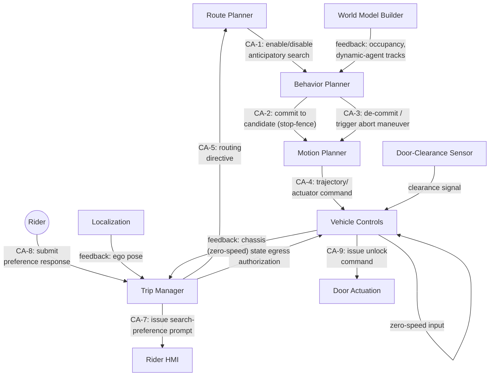

# STPA - Full Process

Anticipatory Stopping-Zone Selection for AV Drop-Off

This document runs all four STPA steps against the complete control structure, not just the two control actions worked in depth elsewhere. Every control action identified in Step 2 is screened against the full hazard list in Step 3, including the ones that produce no unsafe control action - those are recorded with the reasoning for why not, not omitted.

------------------------------
## Step 1: Losses, Hazards, Safety Constraints

**Losses**
* L1 - Injury or fatality to a road user external to the vehicle (pedestrian, cyclist, occupant of another vehicle).
* L2 - Injury or fatality to the rider (this vehicle's occupant).
* L3 - Damage to the vehicle or to curb-side property, without injury.
* L4 - Mission failure: the rider is not delivered to a safe stop within acceptable time or quality. Non-safety - a service/availability loss, tracked for completeness, not carried into the same rigor as L1-L3.

**System-Level Hazards**
* H1 - The vehicle enters, or remains in, a lane or path without verified clearance from another road user or obstruction, for as long as it occupies that lane or path. → L1, L2, L3
* H2 - The vehicle enables rider egress without the vehicle's position, motion state, and surrounding clearance all being currently verified safe. → L2
* H4 - The vehicle's mission-management logic produces indefinite delay or failure to deliver the rider, without itself creating an unsafe vehicle state. → L4. Non-safety; screened in Step 3 for completeness, not carried into Step 4.

**Safety Constraints**
* SC1 (from H1) - The vehicle must not enter or remain in a lane or path without continuously verified clearance from other road users and obstructions, for the full duration it occupies that lane or path.
* SC2 (from H2) - The vehicle must not enable rider egress unless position, motion state, and surrounding clearance are all currently verified safe.
* SC3 (from H4, availability, not safety) - Search enablement, rider negotiation, and routing escalation must resolve within a bounded time or fail over to a defined default rather than remain unresolved indefinitely.

------------------------------
## Step 2: Control Structure - All Control Actions

Controllers with control actions in this system: Route Planner, Behavior Planner, Trip Manager, Motion Planner, Vehicle Controls, and the Rider (a human controller, acting through the Rider HMI). Perception, Prediction, Localization, World Model Builder, the Door-Clearance Sensor, and the Cloud Prior Layer are feedback/sensing elements in this structure - they inform a controller's process model but issue no control action of their own.

CA-9 (Vehicle Controls' unlock command) is the local AND-gate combining CA-6, Vehicle Controls' own zero-speed check, and the Door-Clearance Sensor's clearance signal (exhaustive_failures_list.md, Item 38) - it is a distinct control action from CA-6, one step further downstream, and is screened separately below.

------------------------------
## Step 3: Unsafe Control Action Screening

Each control action is checked against Not Providing / Providing / Wrong Timing / Wrong Duration. A result of "no hazard identified" is recorded with its reasoning, not omitted.

**CA-1 - Route Planner → Behavior Planner: enable/disable anticipatory search**
* Not providing: search never enabled; vehicle proceeds without attempting a curb-adjacent stop. → L4 only. No H1/H2 path - Behavior Planner's own commit gate never engages, so no unsafe vehicle state results, only a missed service opportunity.
* Providing (enabled when it shouldn't be, e.g., too early): wasted search cycles; any candidate found still has to clear Behavior Planner's own commit checks (CA-2) regardless of when search started. → L4 only.
* Wrong timing (enabled too late): candidates may be missed or search may be compressed. This can feed into CA-2's own insufficient-stopping-distance UCA (below) as a contributing timing factor, but produces no independent hazard at the CA-1 level itself.
* Wrong duration (flag stays on past when it should turn off): continued evaluation after mission should have ended. → L4 only.
* **Conclusion: no UCA carried to Step 4.** Matches the existing failure list's disposition of this logic as a functional requirement, not a hazard item - Step 3 independently confirms that scoping rather than assuming it.

**CA-2 - Behavior Planner → Motion Planner: commit to candidate (stop-fence constraint)**
* Not providing (no commit issued despite a valid candidate existing): search continues or exhausts. → L4 only.
* Providing (commit issued for a candidate that is actually obstructed, undersized, or restricted): → **H1, H3-adjacent (property/kinematic), L1/L3.** This is exhaustive_failures_list.md Item 20/4 (commit decision inherits bad upstream input). **Real UCA - carried to Step 4** (already worked as part of the existing failure-list item; not re-derived here as a new loss-scenario document).
* Wrong timing (commit issued with insufficient remaining stopping distance): → **H1, L1/L2/L3** (abrupt or unsafe stop). This is Item 21/5. **Real UCA - carried forward**, same basis.
* Wrong duration: the stop-fence constraint's parameters remaining fixed too long as conditions change is the same question as "when does Behavior Planner release this constraint" - that collapses into CA-3 (de-commit), screened separately, rather than being a distinct finding here.

**CA-3 - Behavior Planner → Motion Planner: de-commit / trigger abort maneuver**
Fully worked in stpa-item24-decommit-abort.md. Summary: UCA1-1 (providing without abort-path clearance check) is the headline unmitigated finding; UCA1-2 (not providing, late de-commit) and UCA1-3 (wrong timing, point-in-time check only) are also real and tracked there.

**CA-4 - Motion Planner → Vehicle Controls: trajectory/actuator command**
* All four categories map onto exhaustive_failures_list.md Items 27-30 (Motion Planner trajectory-tracking limits, actuator-command drop/delay, stale-command execution). These are scoped there as pre-existing baseline execution-chain reliability, inherited unchanged by this feature - this feature adds a new triggering context (stop-fence tracking on tight curb geometry, Item 27) but not a new failure mode.
* **Conclusion: no new UCA.** Step 3 reproduces the existing pre-existing/inherited scoping rather than contradicting it.

**CA-5 - Trip Manager → Route Planner: routing directive**
* Not providing (directive never sent after search exhaustion): per Baseline Dependency F, Route Planner keeps publishing the existing forward path regardless, so the vehicle does not strand - only fallback-hub routing is delayed. → L4 only.
* Providing (directive corrupted or points to an invalid location): scoped in the failure list as a generic interface-integrity concern under the standard internal-interface data-integrity assumption, mission consequence only.
* Wrong timing/duration: same reasoning, mission-timing only.
* **Conclusion: no UCA carried to Step 4.** Matches existing disposition.

**CA-6 - Trip Manager → Vehicle Controls: grant egress authorization**
Fully worked in stpa-item31-egress-authorization.md. Summary: UCA2-1 (providing on stale ground truth) is the headline finding; UCA2-3 (wrong timing, race against zero-speed/DCS freshness) and UCA2-4 (wrong duration, latched authorization surviving a subsequent movement) are also real and tracked there.

**CA-7 - Trip Manager → Rider HMI: issue search-preference prompt**
* Not providing (prompt never issued): default path taken; interface_control_document.md OI-9 leaves the default undefined. → L4 only - no safety-critical control action consumes this default directly; Behavior Planner's own commit gate still applies regardless of which search mode was used.
* Providing at the wrong time or with wrong content: mission-quality consequence only.
* Wrong duration (prompt held open too long, delaying the vehicle's decision): this can compress the time available before Behavior Planner has to search and commit, which is a plausible contributing factor into CA-2's insufficient-stopping-distance UCA above - noted as a contributing link, not an independent hazard at CA-7 itself.
* **Conclusion: no independent UCA.** One contributing-factor link into CA-2 worth naming for the loss-scenario writeup if CA-2 is ever worked in full depth.

**CA-8 - Rider → Trip Manager: submit preference response**
* All four categories: no response, wrong response, late response, or a response held/reasserted too long all resolve to which search mode Trip Manager selects - which is still gated by Behavior Planner's own commit checks (CA-2) downstream. No safety-critical control action is reachable from this input without passing through a gate already screened.
* **Conclusion: no UCA.**

**CA-9 - Vehicle Controls → Door Actuation: issue unlock command**
* Not providing (interlock withholds unlock when it's actually safe): fail-safe by itself (Item 14/34, stranded rider, L4) - **except** where the stop location itself only partially clears the live lane (exhaustive_failures_list.md Item 18, no lateral/width clearance check). If egress is withheld indefinitely at such a location, the vehicle can remain stopped partially encroaching a live lane for longer than intended. → **H1, L1/L3 - a real cross-link surfaced by this screening**, connecting CA-9's fail-safe direction to Item 18's gap rather than a new independent finding. Not worked to full loss-scenario depth here; flagged for follow-up if Item 18 is ever taken through STPA.
* Providing (unlock issued when not all three conditions are actually, currently true): → **H2.** This is Item 38's own finding, confirmed rather than duplicated.
* Wrong timing - a refinement worth stating explicitly: even an AND-gate that is logically correct can be unsafe if it samples AUTH, zero-speed, and DCS-clear asynchronously and treats three values that were each true at different instants as if they were simultaneously true. → **H2.** This is a distinct nuance from Item 38's "doesn't require all three" framing - Item 38 covers a defective gate; this covers a correct gate reading stale-but-latched values as current. Not previously named as its own item; recorded here as a refinement to carry forward if CA-9 is worked to full depth.
* Wrong duration: not distinct at a discrete-command level; collapses into the timing case above, the same pattern as CA-3 and CA-2's duration categories.

------------------------------
## Step 4: Loss Scenarios - Newly Surfaced Findings Not Already Covered

The full screening above reproduces the existing failure-list items for CA-2, CA-4, and CA-5 rather than contradicting them, and defers to the two dedicated documents for CA-3 and CA-6. Two items are new and not yet worked to full loss-scenario depth:

* **CA-9 not-providing × Item 18 cross-link:** withholding unlock indefinitely at a stop location with no verified lateral clearance can leave the vehicle occupying part of a live lane for longer than the stop was ever intended to last. Causal factors would need to trace how "withhold on any doubt" (the fail-safe default) interacts with a lane-obstruction risk that a purely egress-focused interlock was never designed to weigh against.
* **CA-9 wrong-timing (asynchronous AND-gate sampling):** the interlock's three inputs would need a defined simultaneity window (all three latched as true within a bounded time of each other) rather than an unqualified AND, or a stale reading on any one of the three could be read as concurrent with the other two.

Neither has been taken through full loss-scenario causal analysis in this pass - recorded here as the next control actions to work in depth, not as closed findings.