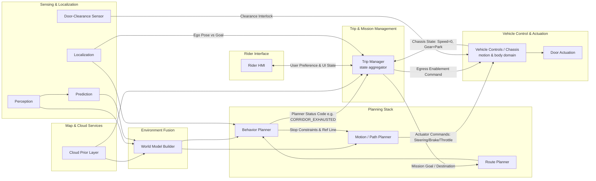

# System Block Diagram

Anticipatory Stopping-Zone Selection for AV Drop-Off

## 1. Purpose

This document defines the functional block structure of the system and the primary data flows between blocks. It establishes the architectural context that the Interface Control Document later builds on to define each interface's content, format, and rate in detail.

## 2. Functional Block Diagram

## 3. Block Descriptions

* **Cloud Prior Layer** - Maintains and serves the time-of-day-aware curb restriction dataset and static map geometry, as a prefetched static grid layer. Also serves fallback-hub/POI location data directly to Trip Manager.
* **Perception** - Detects and classifies objects from sensor data and performs multi-object tracking, assigning identity and velocity estimates to tracked objects. Does not forecast future trajectories.
* **Prediction** - Consumes tracked objects from Perception and produces predicted future trajectories over a defined time horizon. A distinct module from both Perception and Planning, consistent with standard AV stack decomposition (Section 4).
* **Localization** - Provides ego-vehicle position, heading, and speed to Behavior Planner for tactical execution, and ego pose relative to the current mission goal to Trip Manager, which uses it as one of two ground-truth inputs - alongside Vehicle Controls' chassis state - to independently confirm vehicle state rather than relying solely on Behavior Planner's self-reported status.
* **Door-Clearance Sensor** - Dedicated sensor, independent of the primary perception stack, providing the road-user-clearance signal used to gate door actuation.
* **World Model Builder** - Fuses three inputs into a shared representation: the static prior grid layer, the live occupancy grid layer from Perception, and the predicted-trajectory output from Prediction. Its prior-layer fusion already performs any coordinate-frame conversion needed to align absolute (lat/lon) prior data with the vehicle's working frame - a generic, pre-existing capability, not something this project introduces.
* **Trip Manager** - Owns trip-lifecycle and mission-level decisions, and acts as the ground-truth state aggregator for the mission: rather than relying solely on Behavior Planner's self-reported tactical status, it independently tracks ego pose against the current goal (from Localization) and chassis state (from Vehicle Controls) before authorizing egress or closing out the mission. Receives Behavior Planner's planner status code (corridor-exhausted, candidate-committed), negotiates rider preference and relays UI state over the HMI, resolves a fallback-hub location from the Cloud Prior Layer when needed, issues Route Planner a mission goal/destination update, and issues Vehicle Controls the egress authorization once ground truth confirms the vehicle has stopped at the committed location (Section 5, Item BD-3). Pre-existing baseline module (Section 4) - this use case adds new triggering content into it, not the module itself.
* **Route Planner** - Continuously tracks ego-to-destination distance and the destination's ODD-eligibility to set the anticipatory-search flag; reports route/path and progress. Continues publishing the existing forward path past the destination coordinate rather than recomputing on its own. Computes a new route only on an explicit mission goal/destination directive from Trip Manager - a corridor sweep or a route to a fallback hub - using its own standard routing pipeline; does not negotiate with the rider or decide which outcome to pursue.
* **Behavior Planner** - Selects driving behavior - evaluates candidates against the decision tree and executes the search/commit state chart, consuming World Model Builder's fused output as input. Derives per-candidate clear curb length by scanning the fused grid's curb-line, drivable-surface, and restriction layers rather than receiving it pre-computed. Reports a planner status code to Trip Manager - corridor exhausted, or a candidate committed (with its location) - and does nothing further: it does not negotiate with the rider, decide a resulting route, command Route Planner, or authorize egress directly. Trip Manager independently verifies arrival via ground-truth pose and chassis state rather than trusting Behavior Planner's status code alone. Does not perform detection, tracking, or trajectory prediction.
* **Motion / Path Planner** - Executes the commanded maneuver by consuming a reference line / stop-constraint specification from Behavior Planner - a baseline AV-stack mechanism (Section 4 cites the SOTA basis), not something this use case defines or modifies. Publishes actuator commands (steering, brake, throttle) to Vehicle Controls for low-level execution; the trajectory-generation logic itself (how the reference line and stop constraint become actuator commands) remains out of scope for this project - only the fact that this output feeds Vehicle Controls is modeled.
* **Vehicle Controls / Chassis** - Scoped to both the motion domain and the body (door) domain: executes Motion Planner's actuator commands for driving, and separately owns door-actuation authority. Reports chassis state (speed, gear, and door/lock status) continuously to Trip Manager as ground truth for mission tracking, egress authorization, and drop-off completion - a continuous state feed, not a one-time event. Unlocks only on Trip Manager's egress authorization, gated by its own independently-sourced vehicle-state confirmation (zero speed, from a dedicated vehicle-state input distinct from the AV stack's Localization feed) and the door-clearance signal - it does not act on Trip Manager's authorization alone, and does not consume Localization directly (Section 4).
* **Door Actuation** - Physical lock/unlock mechanism, commanded by Vehicle Controls.
* **Rider HMI** - All rider-facing notifications and rider-initiated requests - arrival-imminent notice, search-preference prompt, unlock request - cross exclusively through Trip Manager, which owns UI state as a single source of truth. Rider HMI has no direct interface to Behavior Planner or Vehicle Controls.

## 4. Basis of Design

The architecture follows established precedent rather than a novel design, consistent with the project's stated preference for verifiable, explainable structure over reinvented mechanisms.

The separation of Perception (detection and tracking) from a distinct Prediction module (trajectory forecasting) follows standard practice in open reference AV stacks. Autoware's Perception component performs detection and tracking, assigning identity and velocity to detected objects, and hands off to a separate Prediction module that "sits in a pipeline receiving input from the tracker and publishing output to the planning and control modules" (Autoware Foundation, Perception Component Design; Autoware.Auto Prediction Architecture). Baidu Apollo's architecture is structurally identical: Perception detects and classifies obstacles, and a distinct Prediction module "estimates the future motion trajectories for all the perceived obstacles," with Planning consuming Prediction's output (Apollo 5.5 Software Architecture Specification). Neither reference architecture assigns trajectory prediction to a behavioral- or motion-planning module.

The Behavior Planner's role - selecting a driving behavior via explicit, rule-based logic, using perception and prediction estimates as input rather than producing them - follows the four-layer hierarchy (Route Planning, Behavioral Layer, Motion Planning, Vehicle Control) described in Paden, Čáp, Yong, Yershov, and Frazzoli, "A Survey of Motion Planning and Control Techniques for Self-Driving Urban Vehicles," IEEE Transactions on Intelligent Vehicles, 2016. The survey states the behavioral layer selects behavior "based on the perceived behavior of other traffic participants," treating prediction and intention estimation of other agents as a separate problem studied independently of behavioral decision-making. This same allocation is why Route Planner, not Behavior Planner, owns the anticipatory-search timing decision: Route Planner already holds the position and destination knowledge that decision needs, consistent with its place in this hierarchy.

The prior-plus-live grid fusion performed by World Model Builder follows the layered-costmap pattern used in the ROS Navigation Stack (Lu, Hershberger, and Smart, "Layered Costmaps for Context-Sensitive Navigation," IROS 2014), building on the occupancy-grid concept originating with Elfes (1989). Consistent with this pattern, derived geometric quantities such as candidate curb length are computed downstream of the grid by the consuming planner, matching the behavior described in US12103540B2, "Occupancy mapping for autonomous control of a vehicle."

The rule-based, priority-ranked structure of the Behavior Planner's stopping-location logic follows US11034351B2 / US10202118B2, "Planning stopping locations for autonomous vehicles" (Waymo LLC), which ranks candidate constraints by priority and relaxes the lowest-priority constraint first when no fully compliant option exists. This use case does not carry that precedent into relaxing a legal restriction under a saturated-curb condition - doing so would mean an autonomous vehicle deciding on its own to violate a parking restriction, which is not an acceptable nominal-operation behavior regardless of priority tier. Instead, when the initial search corridor is exhausted, the system escalates through dynamic spatial expansion and rider collaboration rather than relaxing a constraint: Waymo's own production zone design already reflects this pattern - its pickup/drop-off zone logic supports adaptive zone sizing and re-attempting a stop when the original attempt fails (US10698410B2, "Pickup and drop off zones for autonomous vehicles"), and its deployed "Pull ahead" feature lets a rider request an alternate nearby stop when the original one is unusable (support.google.com/waymo/answer/9696059). This use case's radius-expansion-then-fallback-hub escalation, gated on explicit rider selection via the HMI rather than resolved autonomously, follows that same rider-collaborative pattern rather than a legal-relaxation one.

The separation of door-actuation authority from the planning stack, gated by an independent, dedicated clearance sensor, follows US8650799B2, "Vehicle door opening warning system," which specifies a dedicated door-mounted sensor to close coverage gaps left by mirror- and camera-based systems, in preference to production Safe Exit Assist implementations that share sensing hardware with other vehicle functions.

Behavior Planner, Rider HMI, and Vehicle Controls each interact only with Trip Manager, never directly with each other, consistent with Trip Manager's role as the single source of truth for mission and UI state. `BP --> TM` carries Behavior Planner's planner status code; `TM --> HMI` / `HMI --> TM` carry rider negotiation and UI state; `TM --> VC` carries egress authorization; `DCS --> VC` and Vehicle Controls' own vehicle-state input gate the resulting unlock independently of Trip Manager's claim, consistent with SC6 (sotif-stpa.md) - Vehicle Controls does not consume Localization directly, so this independence from the tactical/mission layers' shared position feed is preserved.

Trip Manager acts as a ground-truth state aggregator rather than a passive router that simply trusts Behavior Planner's self-reported status, applying the same don't-trust-the-upstream-claim principle already established for Vehicle Controls' door-unlock interlock (SC6) one layer up. `LOC --> TM` (ego pose vs. the current mission goal) and `VC --> TM` (chassis state: speed, gear, and door/lock status, continuously) give Trip Manager two independent, physically-grounded signals to confirm the vehicle has actually reached and stopped at a location, rather than acting on Behavior Planner's CANDIDATE_COMMITTED status code alone. Behavior Planner's status code establishes intent and location (why the vehicle is stopping, and where); Trip Manager's ground-truth aggregation confirms it actually happened before authorizing egress. Vehicle Controls' chassis-state feed to Trip Manager is a continuous state report, not a one-time "drop-off concluded" event - Trip Manager derives both the egress-authorization moment and the drop-off-concluded moment from the same ongoing feed (the latter once chassis state and door/lock status both confirm secured), rather than needing two separate signal types.

Vehicle Controls' scope spans both the motion domain (executing Motion Planner's actuator commands: steering, brake, throttle) and the body/door domain (egress actuation), consistent with base vehicle platforms, where a single vehicle-control/chassis layer typically owns both. The Behavior Planner-to-Motion/Path Planner interface (`BP --> MP` above) is a baseline AV-stack mechanism, not one this project defines. Behavior Planner communicates a stop intention as a constraint embedded on a reference line or station-time graph - not as a symbolic command - consistent with Baidu Apollo's EM Motion Planner (Fan et al., "Baidu Apollo EM Motion Planner," arXiv:1807.08048), where stop and obstacle decisions are represented as constraints on the planning reference line rather than discrete commands, and with Wei, Snider, Gu, Dolan, and Litkouhi, "A Behavioral Planning Framework for Autonomous Driving" (IEEE IV 2014), where the behavioral layer outputs continuous controller directives (lateral offset, following aggressiveness, target speed) rather than an enumerated command set. `MP --> VC` closes the execution chain those constraints eventually reach; trajectory-generation logic itself (how Motion Planner turns a reference-line constraint into actuator commands) remains out of this project's defined scope.

Route Planner continues publishing the original forward path while the search is active, since the road ahead remains a legal path to have driven. Once the vehicle crosses the destination plus the rider's walking-tolerance threshold with no candidate committed, neither Behavior Planner nor Route Planner resolves what happens next - that responsibility belongs to Trip Manager, a distinct mission-management layer above route computation. This separation has direct precedent: Baidu Apollo's architecture includes a `task_manager` module (e.g., its parking-routing manager) that receives a high-level task trigger, resolves a location from map data, and issues a routing request to the Routing module - architecturally separate from both Planning and Routing themselves. Route Planner's role once it receives Trip Manager's mission goal/destination directive is the same one Autoware's reference architecture assigns its Mission Planner: "calculates the route based on the given goal and map information," with the goal supplied by a layer above it rather than derived by Route Planner itself (Autoware Foundation, Planning Component Design). Route Planner reports the outcome back to Behavior Planner through the existing route/path interface (Baseline Dependency F in icd.md) rather than a new one, since from Behavior Planner's perspective a post-negotiation reroute is not distinguishable from any other route change.

## 5. Items Requiring Engineering Disposition

* **BD-1** - Rider-initiated versus autonomous door unlock. Status: open - recommend disposition as a trade study; see SE Documentation Roadmap.
* **BD-2** - Door-Clearance Sensor technology selection (dedicated sensor versus repurposed corner radar). Status: dedicated sensor specified per Section 4; cost/complexity trade-off not yet quantified.
* **BD-3** - Route Planner shall continue publishing the existing forward path once the vehicle passes the original destination. Once the vehicle crosses the destination plus the rider's walking-tolerance threshold without a committed candidate, Behavior Planner shall signal Trip Manager (CORRIDOR_EXHAUSTED) and take no further part in resolving the outcome; Trip Manager shall prompt the rider via the HMI for a preference (expand the search or divert to a fallback hub) and issue Route Planner a mission goal/destination directive reflecting the outcome; Route Planner shall compute the resulting route only on that directive. Status: assumes Route Planner has access to a baseline trip-complete signal, received independently of this use case, to distinguish this case from ordinary trip completion. Reflected in state_chart.md's `AwaitingRiderPreference`, `RadiusExpansion`, and `FallbackNavigation` states - those states' HMI-facing behavior is owned by Trip Manager, not Behavior Planner, notwithstanding their placement in Behavior Planner's state chart; see icd.md for the resulting interface ownership.
* **BD-4** - Whether Vehicle Controls' chassis-state feed to Trip Manager (speed, gear) needs to explicitly include door/lock status for Trip Manager to determine drop-off conclusion (`Evt_DropOffConcluded`, state_chart.md, requires door-secured and clearance-envelope-clear facts neither speed nor gear alone supply). Status: open - assumed included as part of the same "chassis state" feed rather than a separate interface, pending confirmation (see icd.md, Baseline Dependency Q, Open Item OI-12).